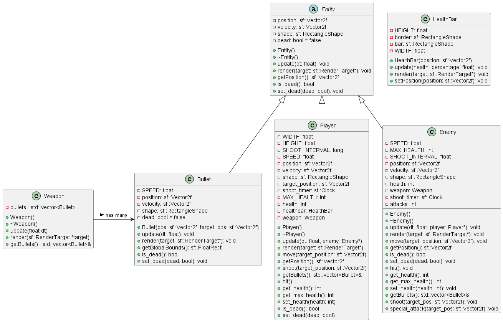

# CPPScape
## A C++ reimagination of the Alchemical Hydra from OSRS
 
## COP 3003 - Programming 2

## Project Functionality
### First Deployment
* Successfully launched SFML and created a functioning game window.
* Designed the player and enemy classes with movement mechanics inspired by Oldschool Runescape, and programmed the enemy to track the player.

### Second Deployment
* Implemented enemy attacks, allowing for strategic gameplay. 
* Implemented player attacks and health bars, making it possible to damage the boss.

## Future Plans
* Enhance the game with textures to improve visual appeal.
* Equip the player with a bow, potions, and food to expand the gameplay experience.

## Project Reason
* I choose this project because of my interest and enjoyment of the mechanics from the boss in the game. 
* I also wanted to challenge my self by creating a fun game from scratch in SFML and use it as a learning oppurtunity to apply my skills from COP 3003. 
* It was a very fun project to test my programming skills by creating a game to be enjoyed by others.

Note: The inheritance subclass does not function currently, although I plan to incorporate it later.

